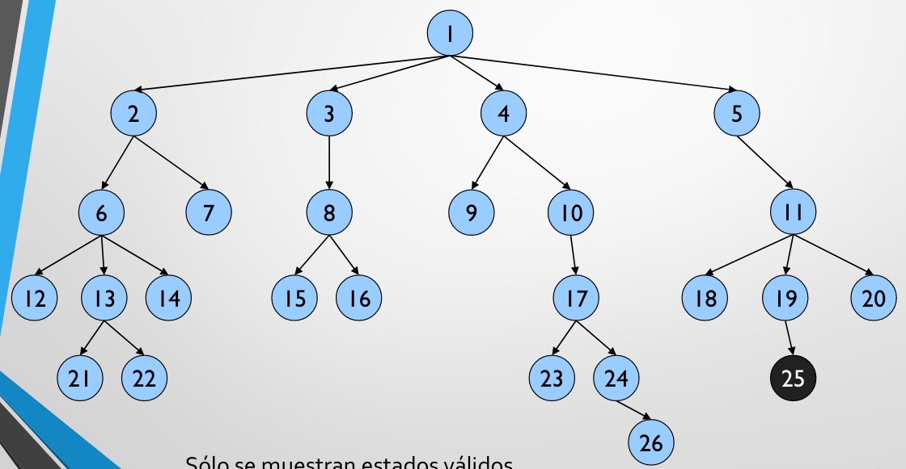

# Ramificacion y poda
## Exploracion de un arbol de estados
Esta tecnica trata de explorar un arbol implicito, igual que en backtracking. Un nodo del arbol representa el estado del problema. Las aristas representan cambios validos.
Para solucionar el problema debemos buscar el nodo solucion y un camino en el arbol asociado.

Al contrario de backtracking el recorrido que se toma es un recorrido en anchura y no en profundidad. Esto viene dado por la creacion de todos los nodos hijos antes de pasar al proximo nivel del arbol. Un ejemplo de este recorrido es el siguiente:


El esquema de este recorrido es el siguiente (solo una solucion):
```java
public void realizarAnchura(Estado e)  
{  
	Cola cola= new Cola(); // Cola FIFO (1o en entrar --> 1o en salir)  
	boolean haySolucion= false; // Para buscar la primera solución  
	Estado actual; // Estado actual  
	cola.insertar(e); // mete estado e en la cola  
	while (!cola.esVacia() && !haySolucion)  
	{  
		actual= cola.extraer();  
		// Examinar todos los hijos del estado actual  
		for (Estado estadoHijo : actual.expandir())  
		{  
			if (estadoHijo.esSolucion())  
				haySolucion= true;  
			else  
				cola.insertar(estadoHijo);  
		}  
	}  
}
```

Tambien tenemos la clase:
```java
public abstract class Estado  
{  
	public abstract ArrayList<Estado> expandir();  
	public abstract boolean esSolucion();  
	[...]  
}
```

Y la clase cola que es donde iremos almacenando los diferentes estados:
```java
public class Cola  
{  
	public void insertar(Estado nodo) {  
		[...]  
	}  
	
	public boolean esVacia() {  
		[...]  
	}  
	
	public Estado extraer() {  
		[...]  
	}  
}
```

En el caso de querer encontrar mas de una solucion lo que debemos hacer son los siguientes cambios:
* Quitar la condicion del while que comprueba si ya se ha encontrado alguna solucion.
* En el condicional si un estado es solucion en vez de asignar true a la variable *haySolucion* lo que hacemos es imprimir por pantalla dicha solucion.

### Ventajas del recorrido en anchura
Si estamos buscando solo la primera solucion puede ser que existan estados solucion muy cerca de la raiz.
Si hacemos un recorrido en profundidad puede ser que nos metamos en ramas con demasiados nodos que no lleguen a ninguna solucion o que sea infinita, cosa que con el recorrido en anchura nunca va a ocurrir.

### Funciones de ramificacion
Los algoritmos de ramificacion consisten en ir desarrollando los nodos segun el orden que indique una funcion heuristica de ramificacion.
En cada momento se desarrolla el mejor nodo hasta el momento, que puede estar en cualquier nivel del arbol.
Los algoritmos de ramificacion tienen sentido cuando se quiere la primera solucion y salir.
En otro caso (desarrollo completo) es mejor algoritmos de backtracking.

Para conseguir que la ramificacion funcione necesitamos hacer el calculo del heuristico en el nodo que estemos creando para ver su importancia dentro del arbol y saber si es con el que tenemos que seguir haciendo la rama. Para esto es necesario implementar nuevos metodos en la clase estado como por ejemplo:
* calcularValorHeuristico()
* getHeuristico()
* compareTo(Nodo nodo2)

La clase Estado por tanto tiene que extender de Comparable para poder hacer *Override* al metodo compareTo().


## Poda o acotacion
A cualquier algoritmo de desarrollo de estados se les puede añadir una funcion heuristica de poda que impide el desarrollo de ciertos estados que no aportan nada a encontrar la solucion del problema. Se puede definir como una cota que permite determinar si tenemos que podar el estado o no.

Para realizar la poda se necesita un metodo mucho mas agresivo que la poda vista hasta ahora (estados no validos, estados no solucion, etc), por eso es tan importante el valor del heuristico calculado en los estados, porque por ejemplo podemos tener estados que no vayan a mejorar a un estado que ya se ha encontrado y en ese mismo momento se poda esa rama.

Si ya tenemos conocimientos previos del problema podemos hacer uso de una cota inicial que lo que nos permitira sera marcar los limites de desarrollo de estados en el arbol.

Otra cosa particular de la poda es que se pueden repetir estados y por lo tanto podria ser interesante el mantener una lista de los estados que ya aparecieron. En la practica esto supone un coste elevado de memoria para albergar dichas estructuras y tiempo de computacion puesto que es necesario comprobar si el estado ya existe o no.


## Ejemplo de ramificacion y poda
